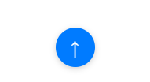

# Desafio 3 - BackButton

Este projeto foi desenvolvido como parte de um desafio proposto pelo professor Luan. O objetivo é implementar um botão de "voltar" (BackButton) funcional em uma página web.

## Demonstração

Veja abaixo uma imagem demonstrando o funcionamento do projeto:

## Como executar

1. Clone este repositório ou baixe os arquivos.
2. Abra o arquivo `index.html` em seu navegador.
3. Interaja com o botão de voltar conforme instruções do desafio.

## Estrutura do projeto
- `index.html`: Página principal do desafio.
- `demo/`: Pasta contendo imagens de demonstração.
- `README.md`: Este arquivo de documentação.

## Autor
Victor nascimento

## Desafio proposto pelo professor Luan.

